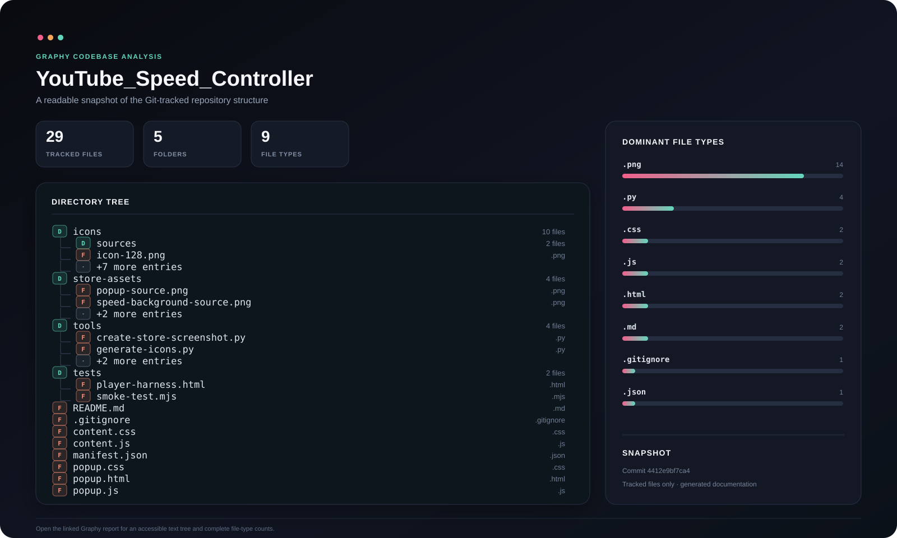

# TurboTube — Video Speed Controller

Lightweight Chromium extension for setting YouTube playback speed from **0.25x to 16x**.

<!-- graphy-map:start -->
## Graphy codebase view

*Tracked repository structure: files, folders, dominant extensions and a readable directory preview.*

[Open full size](docs/graphy/overview.svg) · [Open the accessible Graphy report](docs/graphy/Graphy.md)
<!-- graphy-map:end -->

## Features

- Precise slider and direct input.
- Quick buttons for 1x, 1.5x, 2x, 3x, and 4x.
- Speed preference retained while navigating YouTube.
- Speed control exposed directly in the player.
- Shortcuts: `Alt + Up`, `Alt + Down`, and `Alt + 0`.
- No server, advertising, or data collection.

## Install in Chrome, Edge, or Brave

1. Open the extensions page:
   - Chrome: `chrome://extensions`
   - Edge: `edge://extensions`
   - Brave: `brave://extensions`
2. Enable **Developer mode**.
3. Select **Load unpacked**.
4. Select the `YouTube_Speed_Controller` directory.
5. Open or refresh a YouTube video and click the TurboTube icon.

## Privacy and scope

TurboTube changes only the playback speed property of the video player on the current page. Preferences use the browser's synchronized storage. The extension does not bypass Premium features and does not send data outside the browser.

## Development

The project has no runtime dependency or build step. After changing the source, reload the extension from the extensions page and refresh YouTube.
